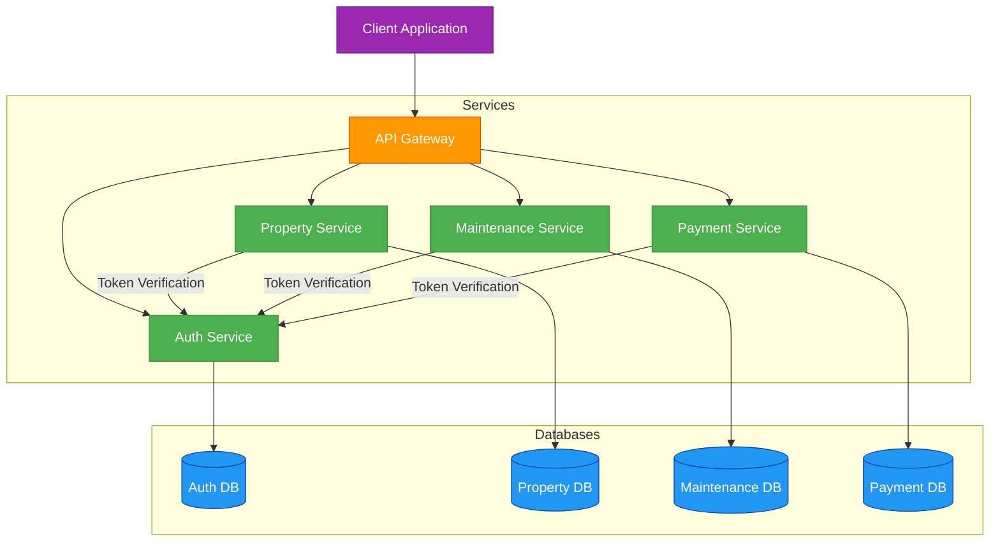
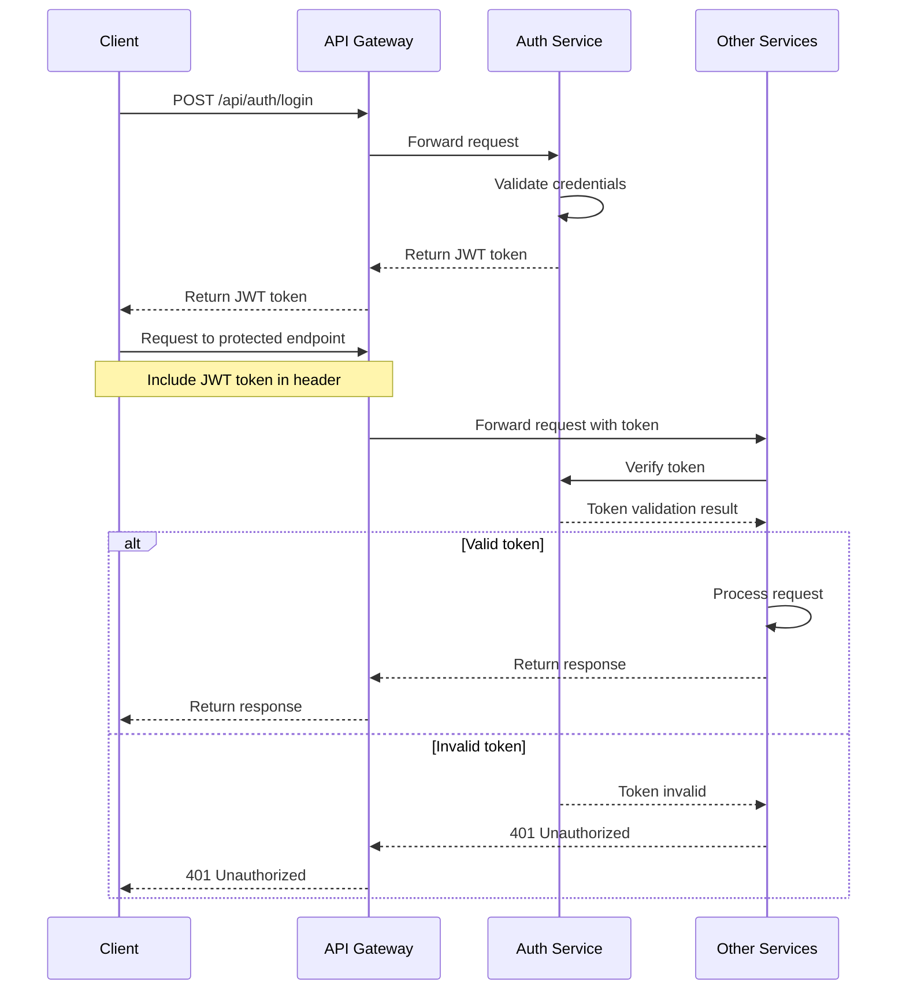
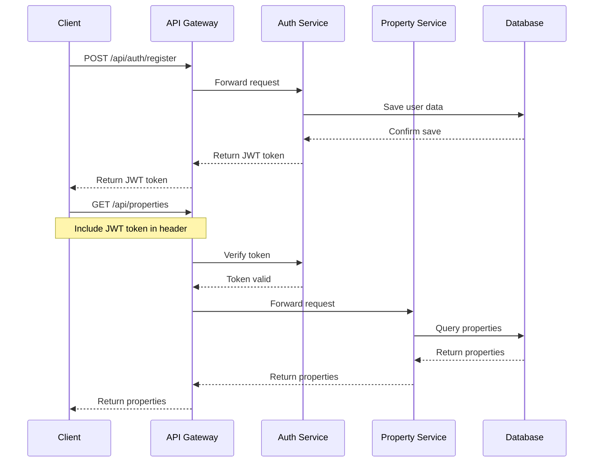

# Property Management System

A multi-microservice Express-MongoDB application for property management with Docker Compose orchestration.

## System Architecture

The system is built using a microservices architecture with the following components:



## Microservices

### 1. Auth Service (Port 3001)
Handles user authentication and management with JWT tokens. Includes models, controllers, and routes for user registration, login, and profile management with three user roles: tenant, property_manager, and property_owner.

### 2. Property Service (Port 3002)
Manages properties, rental applications, and leases. Includes models for properties, rental applications, and leases, with controllers and routes for CRUD operations.

### 3. Maintenance Service (Port 3003)
Handles maintenance requests with features for creating, tracking, assigning, and rating maintenance work.

### 4. Payment Service (Port 3004)
Manages rent payments and other financial transactions with receipt generation.

### 5. API Gateway (Port 3000)
Routes requests to appropriate microservices and provides Swagger API documentation.

## API Documentation

The API documentation is available at `/api-docs` when the application is running. It provides detailed information on all available endpoints, request/response formats, and authentication requirements.

## Authentication

The system uses JWT (JSON Web Token) for authentication. All protected endpoints require a valid JWT token in the Authorization header:

```
Authorization: Bearer <token>
```

Here's how the authentication flow works:



## Data Flow Example

Here's an example of the data flow for user registration and property retrieval:



## User Roles

The system supports three user roles:

1. **tenant** - Can view and apply for properties, submit maintenance requests, and make payments.
2. **property_manager** - Can manage properties, approve rental applications, and handle maintenance requests.
3. **property_owner** - Has all permissions of a property manager plus additional administrative capabilities.

## Running the Application

### Prerequisites

- Docker and Docker Compose
- Node.js (for development)

### Setup

1. Clone the repository
2. Run the application using Docker Compose:

```bash
docker-compose up -d
```

3. Access the API documentation at http://localhost:3000/api-docs

## Development

Each microservice is structured with the following directories:

- `src/models` - MongoDB schemas
- `src/controllers` - Business logic
- `src/routes` - API endpoints
- `src/middleware` - Custom middleware functions
- `src/config` - Configuration files

## API Endpoints

### Auth Service

- POST `/api/auth/register` - Register a new user
- POST `/api/auth/login` - Login and get JWT token
- POST `/api/auth/verify-token` - Verify JWT token
- GET `/api/users/profile` - Get user profile
- PUT `/api/users/profile` - Update user profile

### Property Service

- GET `/api/properties` - List all properties
- GET `/api/properties/:id` - Get property details
- POST `/api/properties` - Create a new property (property_owner, property_manager)
- PUT `/api/properties/:id` - Update property (property_owner, property_manager)
- DELETE `/api/properties/:id` - Delete property (property_owner)
- POST `/api/applications` - Submit rental application (tenant)
- GET `/api/applications/:id` - Get application details
- PUT `/api/applications/:id/review` - Review application (property_owner, property_manager)
- POST `/api/leases` - Create a new lease (property_owner, property_manager)
- GET `/api/leases/:id` - Get lease details
- PUT `/api/leases/:id` - Update lease (property_owner, property_manager)

### Maintenance Service

- POST `/api/maintenance` - Create maintenance request (tenant)
- GET `/api/maintenance` - List maintenance requests
- GET `/api/maintenance/:id` - Get request details
- PUT `/api/maintenance/status` - Update request status
- PUT `/api/maintenance/assign` - Assign request to staff (property_owner, property_manager)
- POST `/api/maintenance/note` - Add note to request
- POST `/api/maintenance/rate` - Rate completed request (tenant)

### Payment Service

- POST `/api/payments` - Create a new payment
- GET `/api/payments` - List payments
- GET `/api/payments/:id` - Get payment details
- POST `/api/payments/process` - Process payment
- GET `/api/payments/:id/receipt` - Generate payment receipt
- GET `/api/payments/history/:leaseId` - Get payment history for a lease 